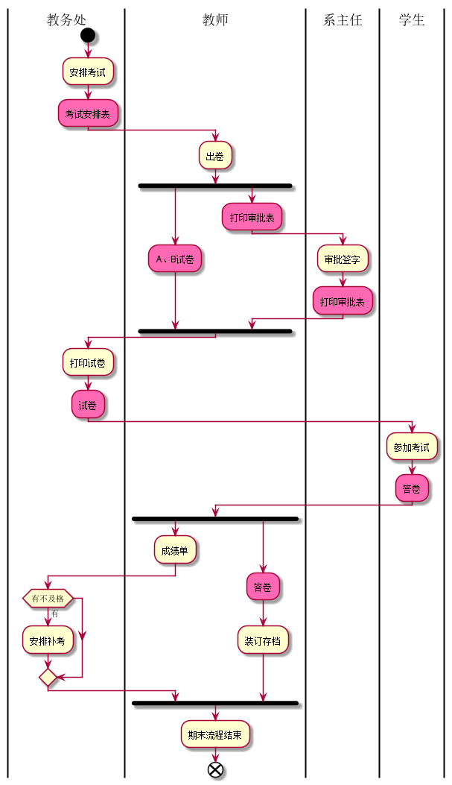
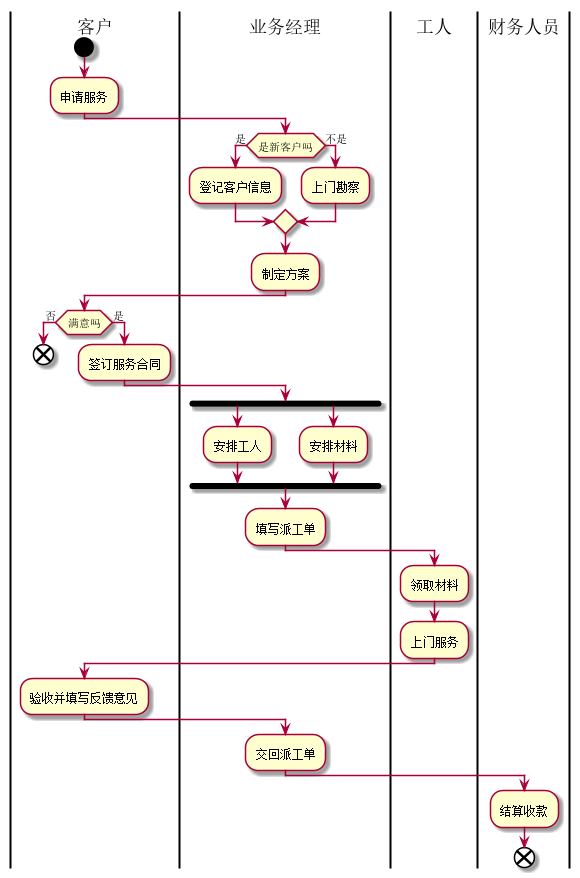

# 实验1：业务流程建模（老师示范）
|学号|班级|姓名|照片|
|:-------:|:-------------: | :----------:|:---:|
|201510414401|软件(本)15-4|陈惠翔||

## 流程图1：考试及成绩管理流程

**PlantUML源码如下：**

``` flow1
@startuml
|教务处|
start
:安排考试;
#HotPink:考试安排表;
|教师|
:出卷;
split
#HotPink:A、B试卷;
split again
#HotPink:打印审批表;

|系主任|
:审批签字;
#HotPink:打印审批表;
endsplit
|教务处|
:打印试卷;
#HotPink:试卷;
|学生|
:参加考试;
#HotPink:答卷;
|教师|
fork
    :成绩单;
    |教务处|
    if(有不及格) then(有)
        :安排补考;
     endif
forkagain
|教师|
    #HotPink:答卷;
    :装订存档;
endfork
:期末流程结束;
end

@enduml
```

**业务流程图如下：**



**流程说明：**

考试及成绩管理流程

## 流程图2： 客户维修服务流程

**PlantUML源码如下：**

``` flow2
@startuml
|客户|
start
    :申请服务;
|业务经理|
if(是新客户吗) then(是)
    :登记客户信息;
else(不是)
    :上门勘察;
endif
    :制定方案;
|客户|
if(满意吗) then(否)
    end
else(是)
    :签订服务合同;
endif
|业务经理|
fork
    :安排工人;
fork again
    :安排材料;
end fork
    :填写派工单;
|工人|
    :领取材料;
    :上门服务;
|客户|
    :验收并填写反馈意见;
|业务经理|
    :交回派工单;
|财务人员|
    :结算收款;
end

@enduml
```

**业务流程图如下：**



**流程说明：**

客户维修服务流程
